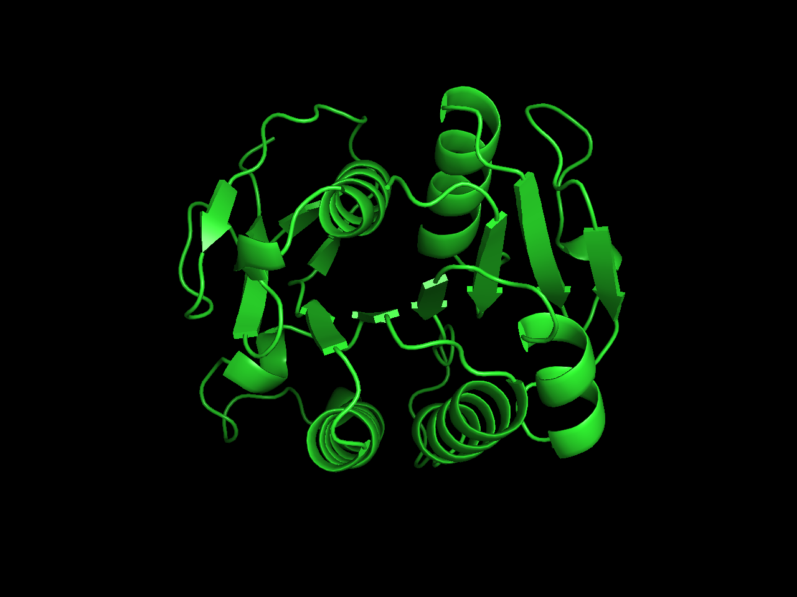

## **HW_1**

---

### **Q1**

A mitosis-associated gene X was experimentally identified in Mus musculus. By DNA sequencing, a partial sequence was obtained as below:

>GATGAGCTGCTTATCCTACAACGAGAAGTCGGACATCTGGTCCTTGGGCTGCCTGCTGTATGAGCTGTGTGCACTAATGCCTCCCTTTACAGCTTTCAACCAAAAAGAGCTAGCTGGGAAAATCAGGGAAGGGAGGTTCAGGCGCATCCCCTACCGCTACTCTGATGGCTTGAATGACCTCATCACTCGGATGCTGAATTTAAAGGACTACCATCGACCTTCAGTGGAAGAAATTCTGGAGAGCCCTTTGATAGCAGACTTGGTTGCAGAAGAGCAAAGGAGAAATCTGGAGAGGAGAGGACGGCGCTCAGGCGAGCCTTCGAAGCTGCCGGACTCCAGCCCTGTGCTGAGCGAGCTCAAGTTGAAGGAAAGGCAACTGCAGGATCGAGAGCAAGCACTCAGAGCTCGGGAGGACATCCT

#### **problem 1**

What's the name of gene X in Mus musculus? Its accession number in GeneBank database and coordinates of mouse genome.

> **Ans**
>   - Name: Nek2(NIMA (never in mitosis gene a)-related expressed kinase 2)
>   - Accession Number: NM_010892
>   - Genome Location: 1 H6; 1 96.94 cM (191552487..191565161)

#### **problem 2**

The homolog of gene X in human, and its accession number.

> **Ans**
>   - Name: Nek2(NIMA related kinase 2)
>   - Accession Number: NG_029112
>   - Genome Location: 1q32.3(211658256..211675621, complement)

#### **problem 3**

In human, the protein product of this gene. Its functions, sub-cellular localizations. Whether it's a enzyme? if so, does it have a conserved functional domain?

> **Ans**
>   - Protein: NP_001191111
>   - Functions: Protein kinase which is involved in the control of centrosome separation and bipolar spindle formation in mitotic cells and chromatin condensation in meiotic cells.
>   - Sub-cellular Localizations: nucleous,centrosome, spindle pole, Cytoplasm, kinetochore, centromere...
>   - Enzyme: yes
>   - Conserved Functional Domain: STKc_Nek2(PKc_like superfamily)

#### **problem 4**

Whethere this gene is conserved in yeast? If so, identify its potential homolog.

> **Ans**
>   - CD in yeast: yes
>   - Homolog: CDC5


#### **problem 5**

The 3D structural information of gene X in human, but not mouse. It's accession number in PDB.

> **Ans**
>   - Accession Number: 2JAV


---

### **Q2**

#### **problem 1**

Randomly select(by writing a program) 10 proteins from the PDB entry list(exlude those with nuc only):(ftp://ftp.wwpdb.org/pub/pdb/derived_data/pdb_entry_type.txt)

> **Ans**
> ```bash
> curl ftp://ftp.wwpdb.org/pub/pdb/derived_data/pdb_entry_type.txt | grep -v 'nuc' > pdb_entry_type.txt
> ```

#### **problem 2**

Give the mapping of the PDB ID to the UnitProt ID, and GenBank ID(if available); Provide the function description of these proteins.

> **Ans**


#### **problem 3**

Manually collect the Scop fold and CATH fold information and compare their difference; Draw the two set of fold structures with RasMol or PyMol; Put these figures together with some software such as Photoshop, CoreDraw.

> CATH 和SCOP 是两个重要的蛋白质结构分类数据库。两者根据结构域的空间特征可以对结构域进行分类。SCOP 数据库与 CATH 类似，也属于蛋白质结构分类数据库，但 SCOP 的分类原则更 多考虑蛋白质间的进化关系，而且分类主要依赖于人工验证。

> **Ans**
>   - SCOP
>       - Classes: 基于二级结构成分分类
>       - Fold: 主要考虑结构的空间几何关系
>       - Superfamily: 基于远源的蛋白质进化关系分类
>       - Family: 基于近源的蛋白质进化关系分类
>   - CATH
>       - C: α型，全β型， α +β型，低二级结构型
>       - A: 按照螺旋和折叠所形成的超二级结构排列方式分类 Architectures
>       - T: 根据二级结构的形状和二级结构间的联系 Topologies
>       - H: 序列比较以及结构比较确定同源性分类 Homologous Superfamily

> **CATH-1a0d**


> **SCOP-1a0d**


> **PyMol-1a0d**

