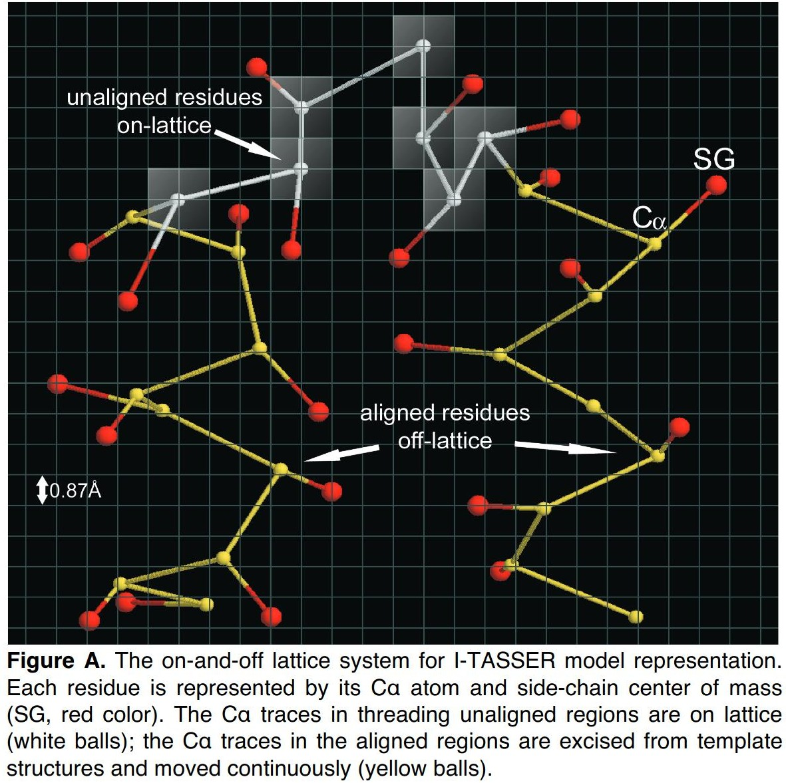
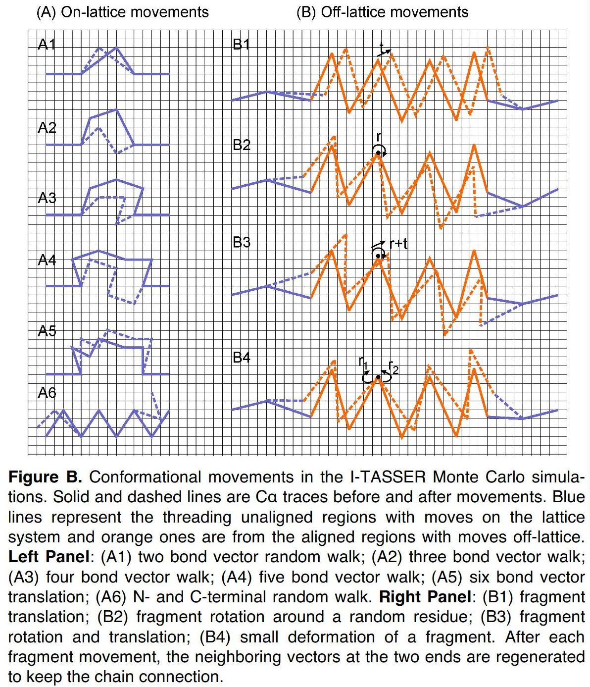
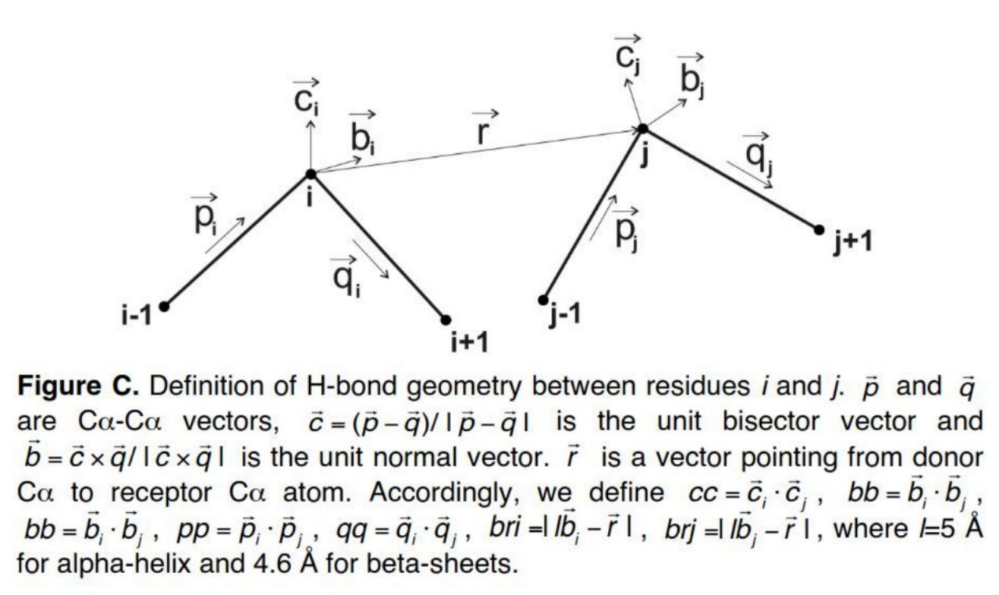

## **蛋白质在`I-TASSER`中的构像**

> I-TASSER模型的拓扑结构由每个分段的相对方向决定，其中未对齐的晶格上区域是从头开始构建的，用作线程片段的链接。

- 每个残基用 $C_\alpha$ 和`侧链的质心`表示。
- 根据LOMETS，查询序列被分割成 `匹配上的子序列` 和 `未匹配上的子序列`，被称为`片段(fragment)`
  - 匹配上的子序列 (`off-lattice system`)
    - 长度 > 5
    - 在蒙特卡洛模拟中保持相对静止
  - 未匹配上的子序列 (`on-lattice system`)
    - 每个 $C_\alpha$ 放在三维网格上
- 只考虑在网格上的 $C_\alpha\text{-C}_\alpha$ ，为减少搜索，我们定义312个晶格键矢量，长度在之间从 $3.25\sim 4.35\mathring{A}$，平均每个 $C_\alpha\text{-C}_\alpha$ 距离为 $3.81\mathring{A}$ 
- 考虑到PDB中几乎没有键角小于 $65^\circ$ 和 大于 $165^\circ$ 的蛋白结构，所以把这些`两键向量(2-bond vector)`排除在外。

### **蒙特卡洛模拟**

> I-TASSER中的实现是基于副本交换的蒙特卡罗模拟(REMC, replica-exchange Monte Carlo simulations)

`未匹配序列（on-lattice）`中的分子的六种震动方式

- (A1) 2-bond vector walk 
- (A2) 3-bond vector walk
- (A3) 4-bond vector walk
- (A4) 5-bond vector walk
- (A5) 6-bond vector walk
- (A6) N- or C-terminal random walk

`匹配上的序列（off-lattice）`中的整体变动方式

- (B1) a translation of fragment
- (B2) a rotation of the fragment around a randomly selected residue
- (B3) a combination of ratation and translation of frangment
- (B4) a small deformation by independently rotationg N- and C-terminal of the fragment

> 根据 REMC protocol，会有 $N_{rep}$ 个副本产生，其中第i个副本的temperature
$$
T_i=T_{min}(\frac{T_{max}}{T_{min}})^{(i-1)(N_{rep}-1)}
$$
$$
\begin{aligned}
& T_{min} : 第一个副本的temperature，1.6\sim 1.98 K_B^{-1} \\
& T_{max} : 最后一个副本的temperature 66\sim 106 K_B^{-1}\\
& N_{rep} : 40\sim 80 \\
& 蛋白质越大越长，副本越多，温度越高
\end{aligned}
$$

### **I-TASSER的力场构建**

>I-TASSER为`匹配上的子序列` 和 `未匹配上的子序列`构建统一的公认的力场规律，其力场主要有下面三种形式

#### 通用统计势能 (Generic statical potentials)

> 来源在PDB中观察到的结构规律

> $$
> \begin{aligned}
> E_{stat}&=\sum_{i<j}^L [E_{contact}(A_i,A_j,g_{i,j},\theta_{i,j}) + E_{pair}(g_{i,j},\theta_{i,j}) + E_{excl}(A_i,A_j,d_{i,j},g_{i,j})] \\
> &+ \sum_{i=1}^L [E_{hydro}(A_i,h_i) + E_{env}(A_i,n_{i,p},n{i,a},n_{i,t}) + \sum_{j=2}^5 \{E_{corr}(A_i,A_{i+j},d_{i,i+j},c_{i,i+j}) + E_{sec}(d_{i,i+5},\vec{r}_{i,i+j}) \}]
> \end{aligned}
> $$
> $$
> \begin{aligned}
> & d_{i,j} : 第i个和第j个氨基酸C_\alpha之间的距离 \\
> & g_{i,j} : 第i个和第j个氨基酸侧链中心之间的距离 \\
> & A_i : 某种氨基酸 \\
> & \theta_{i,j} : 两个链接的残基的侧链形成的方向，分成三种类型，平行、反平行、垂直，对应不同值 \\
> & E_{contact}(A_i,A_j,g_{i,j},\theta_{i,j}) :  基于特定方向的通用接触势能（generic orientation-spcific contact potential） \\
> & E_{pair}(g_{i,j},\theta_{i,j}) : 带权重的接触数量 \\
> & E_{excl}(A_i,A_j,d_{i,j},g_{i,j}) ： C_{\alpha}s 和残基质心之间排除体积势的 soft-core \\
> & E_{hydro}(A_i,h_i) : 亲疏水程度，h_i 表示第i个残基在结构中的深度 \\
> & E_{env}(A_i,n_{i,p},n{i,a},n_{i,t}) : 基于特定方向的接触谱，n_{i，p}、n{i,a}、n_{i,t}分别表示与第i个残基接触的平行残基(parallel)、反平行残基(antiparallel)、垂直残基(perpendicular)个数 \\
> & E_{corr}(A_i,A_{i+j},d_{i,i+j},c_{i,i+j} : 第i个和第i+j个残基之间短程 C_\alpha 距离的相关性，c_{i,i+j}表示局部结构的手性 \\
> & E_{sec}(d_{i,i+5},\vec{r}_{i,i+j}) : 由d_{i,i+5}指定的二级结构倾向，因为\alpha \beta折叠都对应特定的 C_\alpha 的短间距和方向\\
> \end{aligned}
>$$

#### 氢键网络 (Hydrogen-bonding network)

> I-TASSER中的氢键结构由PSSpred二级结构预测的几何结构指定：接触次序(contact order,CO,残基在序列中的距离)、配体和受体之间的距离。这个程序假设，只有两者大于某阈值，才可能形成某些特定氢键

> 氢键能量通过下式计算：
> 
> $$
> E_{HB}=\left\{
> \begin{aligned}
>     & -\sum \frac{W_{HB}(1-|cc-cc_0|)(1-|bb-bb_0|)}{(1+|br_i-br_0|)(1+|br_j-br_0|)} & alpha-helix \\
>     & -\sum \frac{W_{HB}|bb|cc}{(1+br_i/2)(1+br_j/2)} & beta-sheet
> \end{aligned}
> \right.
> $$
> 
> 可见$E_{HB}$为负数，这是为了penalize结构中的氢键结构和标准的氢键的结构差异性。
> 
> 如果预测到两个配受体残基之间形成了alpha-helix或者beta-stands结构，则$W_{HB}=1$，否则 $W_{HB}=0.5$。
> 
> $cc_0,bb_0,br_0$是由STRIDE程序预先从PDB中选取特定数据计算出来的。

#### 基于模板约束的穿线法(Threading template-based restraints)

> 由于质心模型通常包含空间碰撞，因此I-TASSER进行了第二轮装配仿真，以消除局部碰撞并进一步完善全局拓扑。 在第二轮重组模拟中，通过使用TM-align搜索PDB库中与第一轮模拟中的簇质心相似的结构，从检测到的结构模板中添加空间约束（也即来自PDB模板的约束），以下是I-TASSER中的四种约束模式

> $$
> E_{rest}=\left\{
> \begin{aligned}
>     & \sum_{i<j}|d_{i,j}-d_{i,j}^p|, & short-range C\alpha distance with |i-j\le6 \\
>     & \sum_{i>j}-1/|d_{i,j}-d_{i,j}^p|, & long-range C\alpha distance with |i-j>6 \\
>     & \sum_{i>j}-w(conf_{i,j})\theta(6.5-d_{i,j}), & C\alpha contact restriants \\
>     & \sum_{i>j}w(conf_{i,j})\theta(g_{i,j}-g_0^{A_i,A_j}), & C\alpha contact restriants \\
> \end{aligned}
> \right.
> $$
> $$
> \begin{aligned}
> & d_{i,j} : 第i个和第j个残基C_\alpha之间的距离 \\
> & g_{i,j} : 第i个和第j个残基侧链质心之间的距离 \\
> & d_{i,j}^p : 两个C_\alpha之间的预测距离 \\
> & g_0^{A_i,A_j} : 侧链相互的氨基酸的特定截断距离 \\
> & \theta(x) : 阶跃函数，x\ge0时为1,x<0时为0 \\
> & w(conf_{i,j}) : 1+|conf_{i,j}-conf_{cut}| 当约束的置信度(conf_{i,j})大于阈值(conf_{cunt})的时候，否则为1-|conf_{i,j}-conf_{cut}|
> \end{aligned}
> $$

> I-TASSER能量是上述三种能量的线性回归。

## 模型的评价

### 模型结构选取和原子级别的重构

> 在I-TASSER的装配模拟中最常出现的构象是由SPICKER聚类程序选出来的，这些构象对应着在蒙特卡洛模拟中拥有最低自由能量的模型（lowest free-energy）。
> 
> 最终的原子模型由ModRefiner从第二轮模拟中选择的最低自由能的构象开始构建，首先通过$C\alpha$轨道构建主干结构。侧链原子有旋转异构体库(rotamer library)建立，并基于基于物理学和知识的复合力场，通过最小化能量来完善全原子构象。

### I-TASSER结构预测的全局质量评估

> C-score(confidence score)

$$
\text{C-score} = ln(\frac{M}{M_{tot}} \frac{1}{\langle RMSD\rangle} \frac{1}{8}\sum_{i=1}^8\frac{Z(i)}{Z_0(i)})
$$

$$
\begin{aligned}
& M : 代表SPICKER聚类中生成结构的种类 \\
& M_{tot} : 聚类中使用I-TASSER结构诱饵（structure decoys）的总数 \\
& \langle RMSD\rangle : 诱饵到集群质心的平均RMSD（均方根误差，root-mean-square deviation）\\
& Z(i) : 第i个LOMETS穿线程序生成的模板最高分 \\
& Z_0(i) : 第i个LOMETS穿线程序区分好坏模板得分的阈值
\end{aligned}
$$

大量基准测试表明C-score和I-TASSER模型准确性的有强相关性。

C-score和TM-score的相关系数为0.91,C-score和RMSD相关系数为0.75

关系有以下估计
$$
\left\{
\begin{aligned}
    & \text{TM-score} = 0.0006C^2+0.13C+0.71 \\
    & \text{RMSD} = 0.09(C-lnL)^2-1.14(C-lnL)-3.17
\end{aligned}
\right.
$$
$$
\begin{aligned}
& C : C-score \\
& L : 目标序列的长度
\end{aligned}
$$

### I-TASSER结构预测残基级别的局部质量评估

> 由于仿真模拟中的变化和同源序列的不确定性，开发ResQ算法对I-TASSER预测结构进行残基级别的局部质量评估。
>
> 为了训练该方法，首先从 PDB 中选取 1270 个非冗余单域蛋白质的结构，然后使用I-TASSER进行预测。这些蛋白质随机分为两组训练和测试蛋白质。 支持向量回归 (SVR) 用于训练 I-TASSER 模型的残基特定距离误差，与原生结构相比，有以下五个特征

#### 装配模拟中的结构变化

> 一般而言，具有较高变异性的残基相对于天然残基具有较大的误差

> $$
> \left\{
> \begin{aligned}
>     & \mu_j &=& \frac{1}{N} \sum_{i=1}^Nd_i,j \\
>     & \nu_j &=& \sqrt{\frac{1}{N}\sum_{i=1}^N(d_{i,j}-mu_j)^2}  
> \end{aligned}
> \right.
> $$
> $$
> \begin{aligned}
> & N : SPICKER聚类中的诱饵（decoy）数量 \\
> & d_{i,j} ： TM-score叠加后第i个诱饵结构与质心结构模型之间的第j个残差的距离
> \end{aligned}
> $$

#### 最终模型和基于序列的特征预测之间的一致性。

> 模型和预测之间SS(目标序列的二级结构)和SA(溶剂可及性)不一致的残基通常具有较大的误差

#### 线程(Threading)对齐覆盖

> 残基的对齐覆盖率定义为具有查询残基对齐的线程模板的数量除以模板总数除以LOMETS。线程(Threading)越多，模型精度越高

#### 来自LOMETS穿线的模板结构变化

定义为
$$
\lambda = \frac{1}{N}\sum_{n=1}^{N_j}d_n(j)
$$
$$
d_n(j) : 模型上的第 j 个残差与与查询中的第 j 个残差对齐的第 n 个模板上的残差之间的距离
$$
#### 来自TM-align结构比对的模板结构变化

> TM-align将查询结构模型针对非冗余PDB库进行处理，以查找共享相似拓扑的模板。
> 
> 从 I-TASSER 模型和模拟诱饵开始，ResQ 为每个残差生成距离误差估计。 对 506 种 I-TASSER C-score>-1.5 的非冗余蛋白质进行的基准测试表明，与 X 射线晶体学数据相比，残留水平准确度的平均误差 <1.5 Å

### B-因子 估计

> B 因子与局部原子和残基的固有热迁移率相关，这对于蛋白质在生理环境中折叠和发挥作用至关重要。

#### 基于模板的配对

> LOMETS 和 TM-align 从原始 PDB 条目中提取的顶级同源和类似模板，计算B-因子的实验值，然后I-TASSER基于这些实验值给每个查询序列的残基分配B-因子。

$$
b_q(j) = \frac{1}{n}\sum_{i=1}{n_j}b_t(i,j)
$$
$$
\begin{aligned}
& n_j : 与查询残基 j 上对齐残基的模板的数量 \\
& b_t(i,j) : 通过LOMETS和TM-align与j对齐的第i个模板的归一化B-因子值
\end{aligned}
$$
#### 序列谱

> 对 635 种非冗余蛋白质的基准测试显示ResQ 估计的 B 因子与 X 射线晶体学数据的 Pearson 相关系数为 0.60

